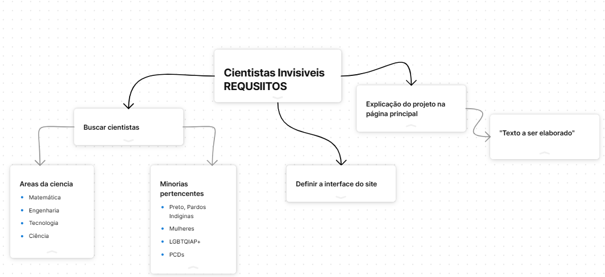

# Organização do projeto

Ellipse, with text label ""

Rect, with text label "Math"

Rect, with text label "Tec"

Rect, with text label "Tec"

Rect, with text label "Cie"

Rect, with text label "PPI"

Rect, with text label "LGBT"

Rect, with text label "Math"

Rect, with text label "Tec"

|           | Matemática                                                                                                     | Engenharia                                                                                                                      | Tecnologia                                                                        | Ciência                                                                                                   |
| --------- | -------------------------------------------------------------------------------------------------------------- | ------------------------------------------------------------------------------------------------------------------------------- | --------------------------------------------------------------------------------- | --------------------------------------------------------------------------------------------------------- |
| PPI(A?)   | David Blackwell&#xA;Elbert Frank Cox&#xA;Francis Williams                                                      | Otis Boykin&#xA;Charles F. Bolden Jr.&#xA;Archie Williams                                                                       | Dorothy Vaughan&#xA;Clarence "Skip" Ellis&#xA;Dr. Evelyn Boyd Granville           | Tu Youyou&#xA;George Washington Carver&#xA;Percy Julian&#xA;Ernest Everett Just                           |
| LGBTQIAP+ | Charles E. F. Doolittle&#xA;Cleyton Carneiro & Rodrigo Gouvêa&#xA;Ron Buckmire&#xA;Katrin Wehrheim (contactar) | Lynn Conway&#xA;Martine Rothblatt                                                                                               | Alan Turing&#xA;Lynn Conway&#xA;Tim Gill&#xA;Tim Cook&#xA;Megan Smith             | Jane Rigby&#xA;Chanda Prescod‑Weinstein&#xA;Sally Ride&#xA;Florence Nightingale&#xA;nergis mavalvala&#xA; |
| PCDs      | Stephen Hawking&#xA;Leonhard Euler&#xA;Benjaman Banneker&#xA;john nash                                         | Temple Grandin?&#xA;Solomon Lefschetz (acidente)&#xA;Thomas Midgley Jr. (poliomilite)&#xA;Jaime Filipe&#xA;Jorge Afonso Martins | Norbert Wiener                                                                    | Thomas Edison (surdo)                                                                                     |
| Mulheres  | Hipátia de Alexandria&#xA;Katherine Johnson&#xA;Emmy Noether&#xA;Maryam Mirzakhani&#xA;Caroline L. Doolittle   | Edith Clarke&#xA;Mary Jackson&#xA;Stephanie Kwolek (kevlar)                                                                     | Grace Hopper&#xA;Ada Lovelace&#xA;Radia Perlman&#xA;Hedy Lamarr&#xA;Ann Mei Chang | Marie Curie&#xA;Rosalind Franklin&#xA;Rachel Carson                                                       |
|           |                                                                                                                |                                                                                                                                 |                                                                                   |                                                                                                           |

[Homepage of Katrin Wehrheim
](https://math.berkeley.edu/~katrin/)Mais conteudos

[Para ampliar a diversidade no ensino e na pesquisa de matemática : Revista Pesquisa Fapesp](https://revistapesquisa.fapesp.br/o-teorema-da-diversidade/)
